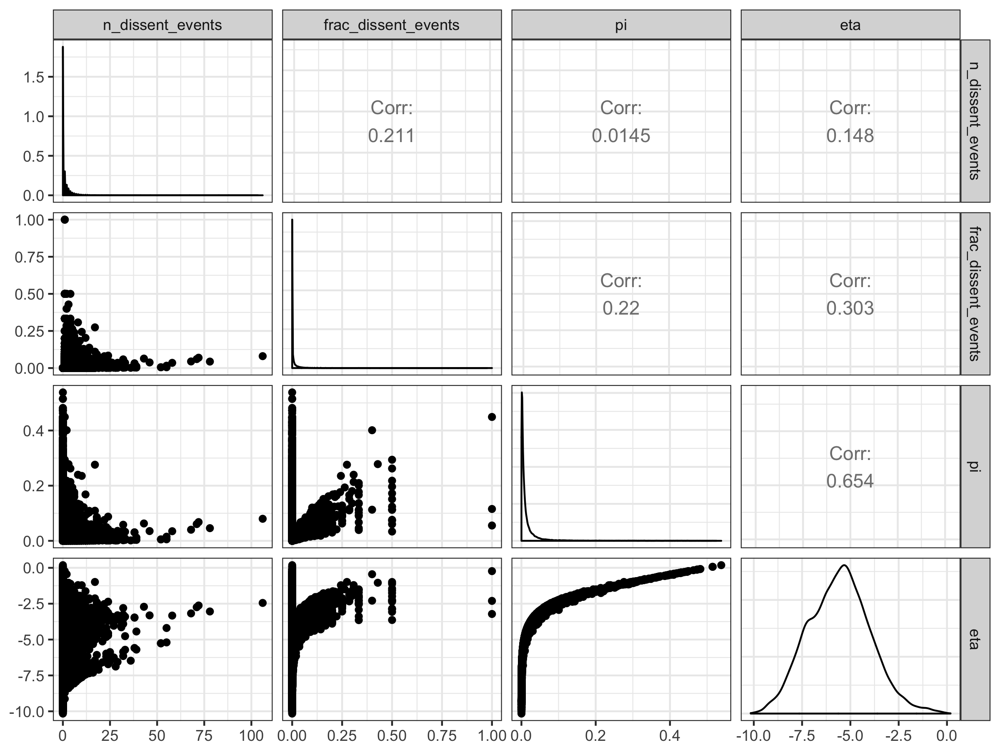
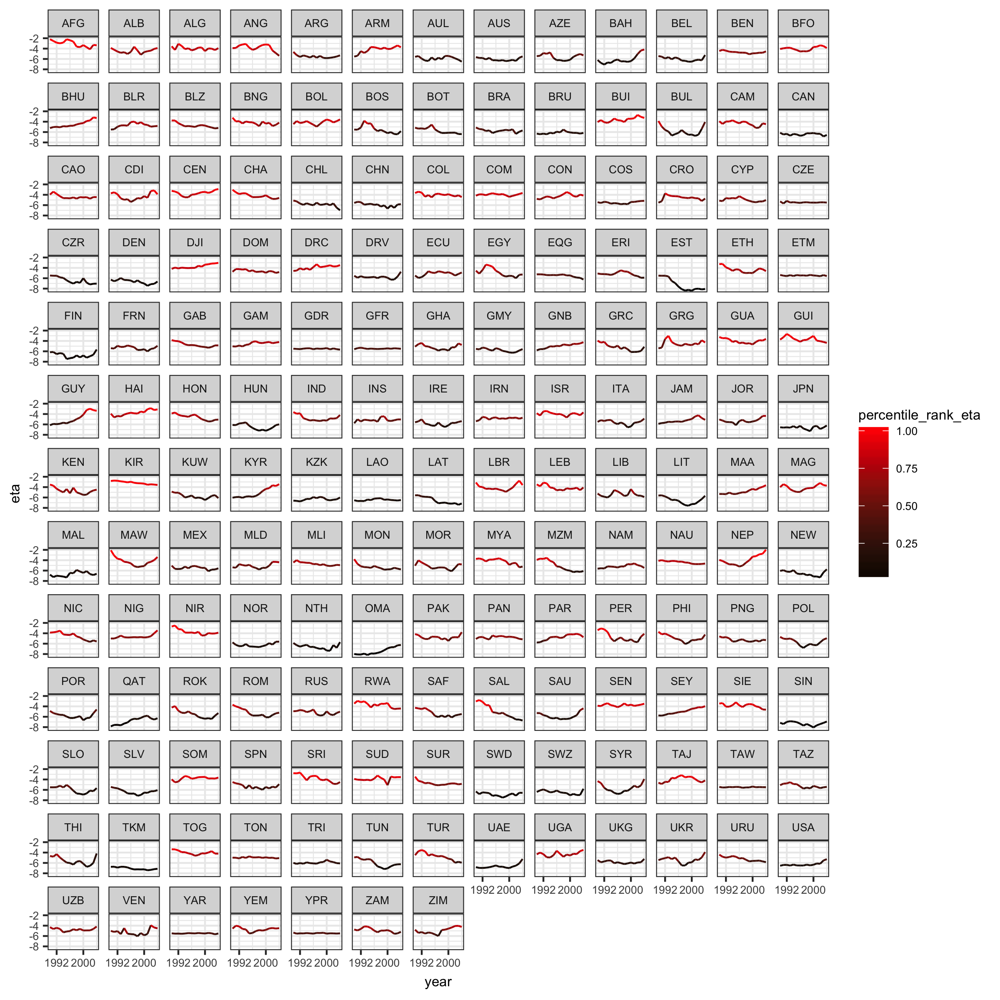
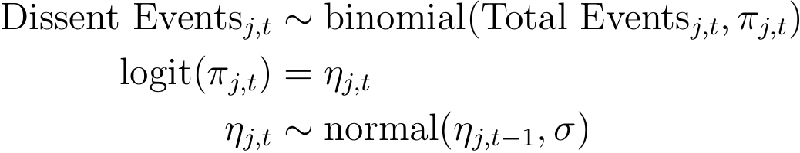
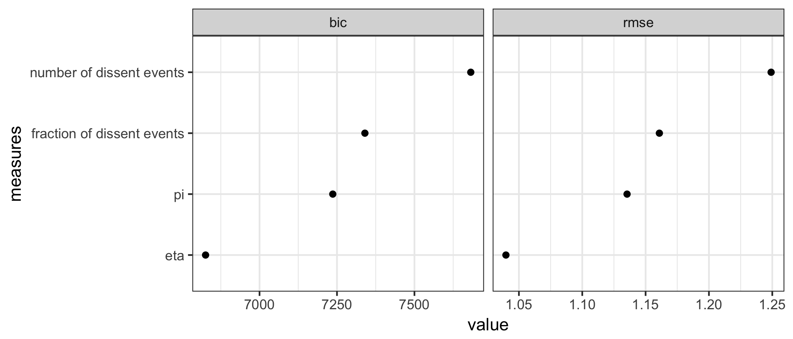
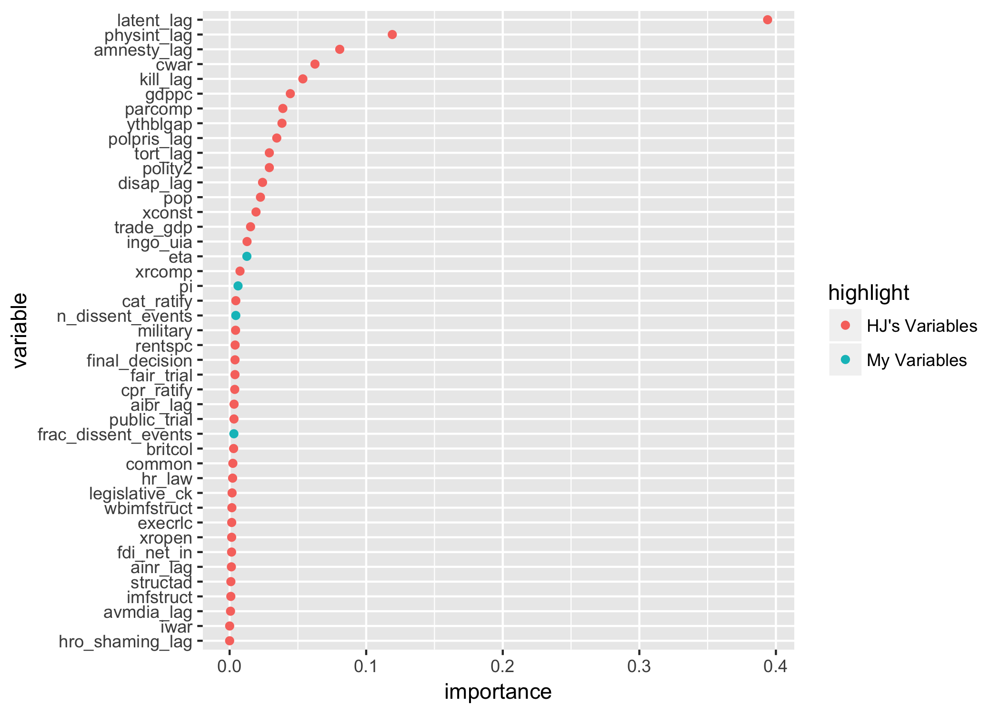
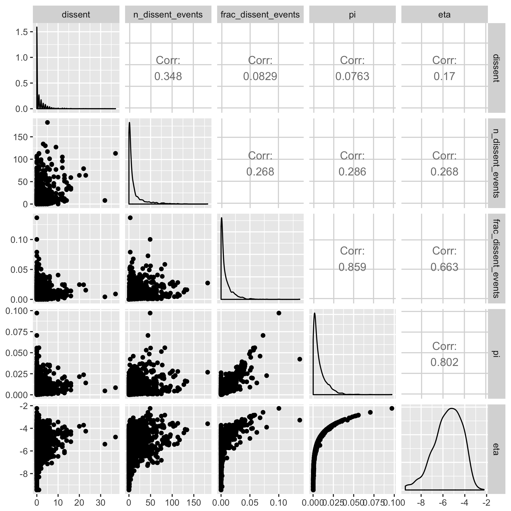
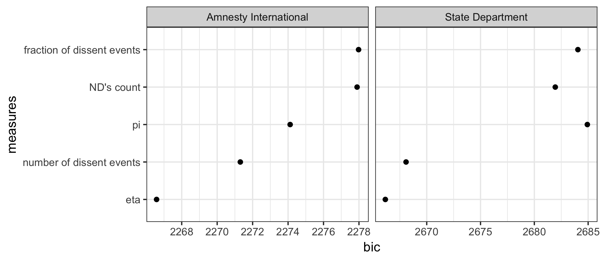
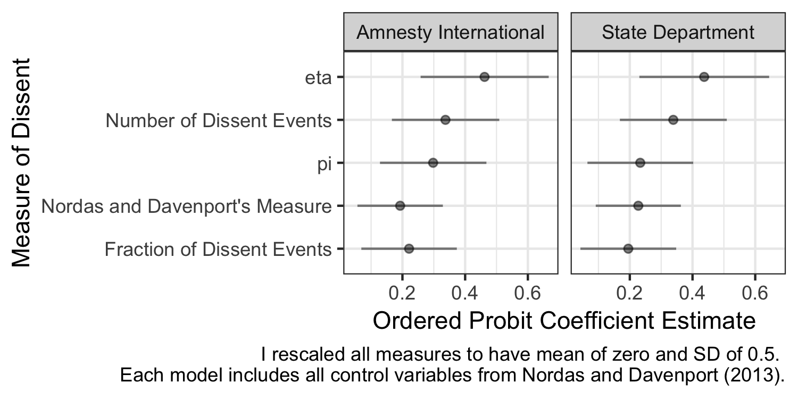

# A Latent Measure of Dissent

## Background

A while back, I was looking around for a country-year measure of dissent, and I realized that many researchers use ad hoc measures, mostly relying on events data. This project develops a standard, easy-to-merge, country-year data set (similar in spirit to Chris Fariss's measure of repression) containing both raw (unmodeled) and latent (modeled) measures of dissent.

In the human rights literature, researchers commonly to use the fraction of dissent events (number of dissent events divided by the total number of events) as a measure of dissent. In countries like the U.S., with thousands of annual events, this fraction serves as a good measure of the concept of interest.

On the other hand, in a country like Cape Verde that only has about four total events per year, this presents a problem. Because the event-data algorithm captures so few events, most years have have 0 events--much lower dissent than the U.S.. But eventually, the algorithm finally captures a dissent event, and the fraction of dissent events jumps to 0.25--an extremely high level of dissent. Of course, these changes are mostly noise.

My latent measure simply smooths the year-to-year changes where the data offer little information about the level of dissent. It learns the about the year-to-year similarity in the level of dissent for high-information countries (like the U.S.) and uses that year-to-year similarity to smooth the measure for low-information countries (like Cape Verde).

## The Data

### An Overview

This code serves as a proof of concept that I wanted to share with colleagues to determine its potential usefulness. The original data come from King and Lowe's "10 Million International Dyadic Events" on [Dataverse](http://hdl.handle.net/1902.1/FYXLAWZRIA).

In previous versions, I borrowed heavily from data cleaned and shared by Emily Ritter, especially her 2014 paper "Policy Disputes, Political Survival, and the Onset and Severity of State dissent" in *JCR*. You can find the details on her [research page](https://www.emilyhenckenritter.com/research/), including her [replication data (`.zip`)](https://www.emilyhenckenritter.com/s/RitterJCR2014Replication.zip) that I previously used in my analysis.

I also relied on written work and replication data publicly posted by [Amanda Murdie](http://www.amandamurdie.org/index.html), especially her 2011 paper "Aiding and Abetting: Human Rights INGOs and Domestic Protest" in *JCR* with Tavishi Bhasin.

The output is a country-year data set that contains two latent measures of dissent (`pi` and `eta`). These data sets (`latent-dissent.csv` and `latent-dissent.dta`) contain the following six variables:

- `n_dissent_events`: the number of dissent events that occur in a country-year. Based on the IDEA data, see Ritter (2014).
- `frac_dissent_events`: the fraction of the events that occur in a country-year that are dissent events. It's the number of dissent events divided by the total number of events.
- `pi`: the latent probability that an event is a dissent event. This latent measure of dissent ranges from zero to one (at least in theory).
- `eta`: The logit transformation of `pi`. This latent measure of dissent ranges from negative to positive infinity (again, in theory).
- `se_eta`: The posterior standard deviation of `eta`.
- `year` and `ccode`: the year and COW code for merging.

To load the data into R directly from GitHub, you can use the following, which will always give you the latest version:

    dissent <- rio::import("https://raw.githubusercontent.com/carlislerainey/latent-dissent/master/latent-dissent.csv")

You can download the `.dta` file by clicking [here](https://github.com/carlislerainey/latent-dissent/blob/master/latent-dissent.dta?raw=true).  

### A Comparison

The figure below shows the relationships among the four measures of dissent. Notice that these measures are relatively uncorrelated with each other.

The figure below shows the latent measure of dissent, `eta`, that makes the most theoretical sense to me. It also turns out that this measure predicts repression better than the other three (see below).

### The Model

In short, I model the number of dissent events in country *j* at time *t* as following a binomial distribution.

The key part is the random walk prior, which simply builds the intuition that the dissent in the period ought to be similar to the dissent in the previous period. I interpret `eta` and `pi` as latent measures of dissent.

For the details, see the Stan model [here](src/binomial.stan).

I use Stan to fit the model. This offers a tremendous advantage because Stan can quickly convert between HMC-NUTS and variational inference. Variational inference is extremely useful for this problem, because it allows me to quickly simulate from an approximate posterior, even when the model contains hundreds of thousands of parameters.

## Three Quick Evaluations of the Measures

To obtain an initial sense of how well the four alternative measure of dissent explain the variation in dissent. I conducted three rough analyses.

### Predicting Fariss's Measure of Repression

First, I use the four measures of dissent to predict Fariss's [latent measure of repression](http://humanrightsscores.org). These are just linear regressions with a single explanatory variable (one regression for each measure of dissent) predicting Fariss's measure of repression. As one would probably expect/hope, the *latent* measures perform best and `eta` (along the entire real line) outperforms `pi` (in the interval (0, 1)). The figure below shows the BIC and (in-sample) R.M.S. error of the regressions.

### Hill and Jones (2014)

Second, I did a re-analysis in the spirit of [Hill and Jones (2014)](https://github.com/zmjones/eeesr). I just added the my four variables to their large suite of other explanatory variables. I tossed all these variables into a random forest and computed the variable importance. The latent measures of dissent aren't as important as the lagged measures of repression or civil war, but they do better than about half of Hill and Jones' collection. Again, `eta` outperforms the other measures. The figures below compare the variable importance of the many potential predictors of repression.

### Nordas and Davenport (2013)

Third, I re-fitted the models in Nordas and Davenport (2013). The figures below show the correlations among the measures in my data set and their `dissent` measure. I also show the BIC for the five measures (their one and my four) for the models predicting both the Amnesty and the State outcomes. Finally, I show the coefficients for their model predicting the Amnesty and State outcomes. Notice three things: (1) the measures aren't terribly correlated with each other, (2) again, `eta` predicts best (smallest BIC), and (3) `eta` has the largest effect of all the measure, roughly doubling the estimate for Nordas and Davenport's measure (I standardize each measure to have an average of 0 and an SD of 0.5, so the coefficient magnitudes are comparable.)

## Reproduction

The repo does not contain the raw data (GitHub size limitations), but you can automatically download and clean them with `make data` (or running R scripts `00-*` through `05-*`), producing several intermediate data sets and the cleaned data set `data/idea-counts.csv` that I use to fit the model. The repo *does* contain `data/idea-counts.csv`, so, even without the raw data, you can fit the model with `make model`  (or running R script `06-*`) and perform the tests with `make tests` (or running R scripts `07-*`, `08-*`, and `tests-*`). Reproduce the entire analysis (from raw data to tests) with `make` or `make all`.
